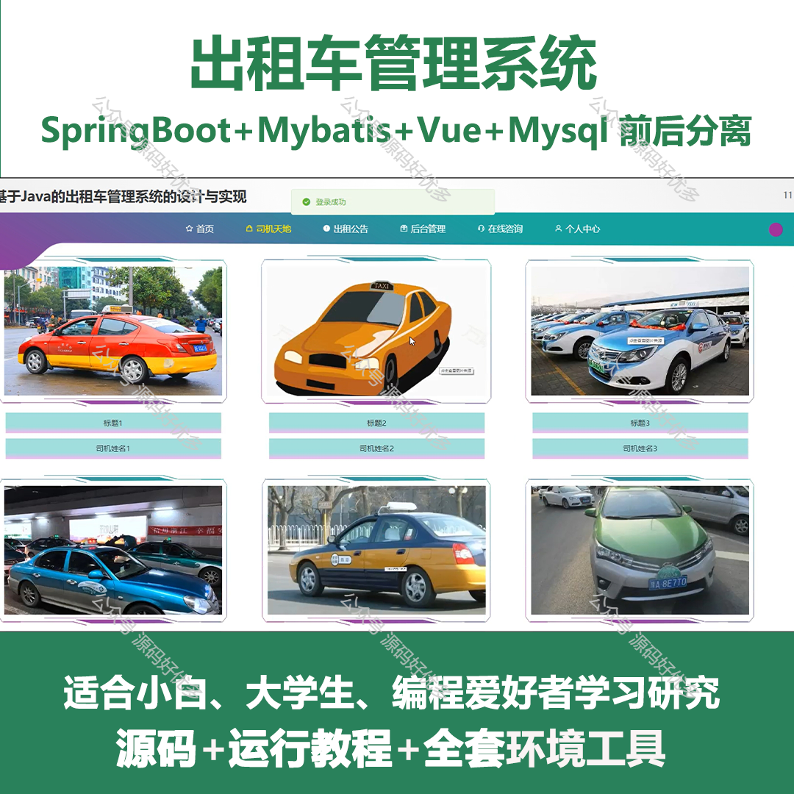
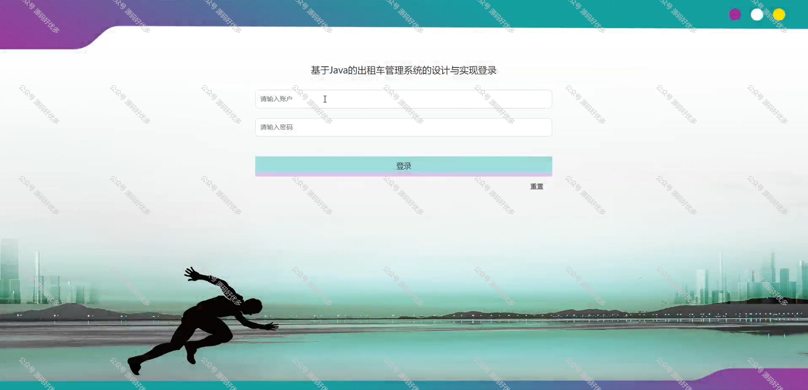
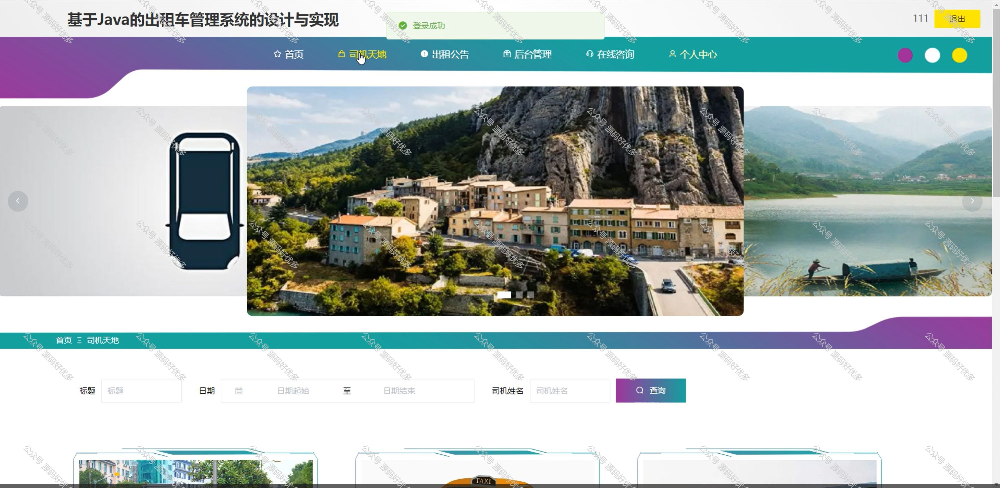
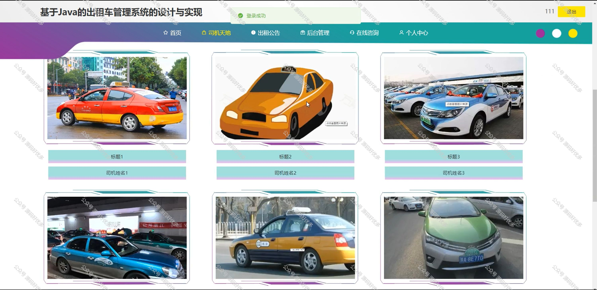
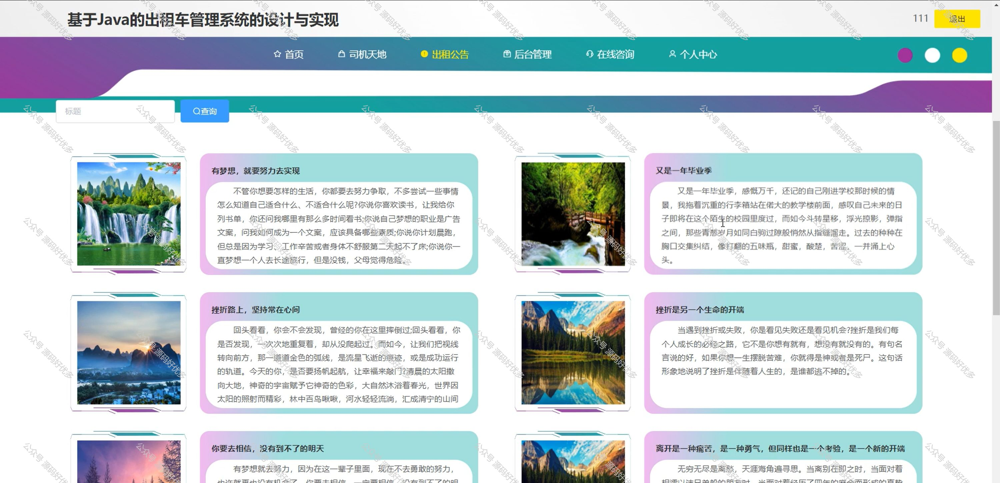
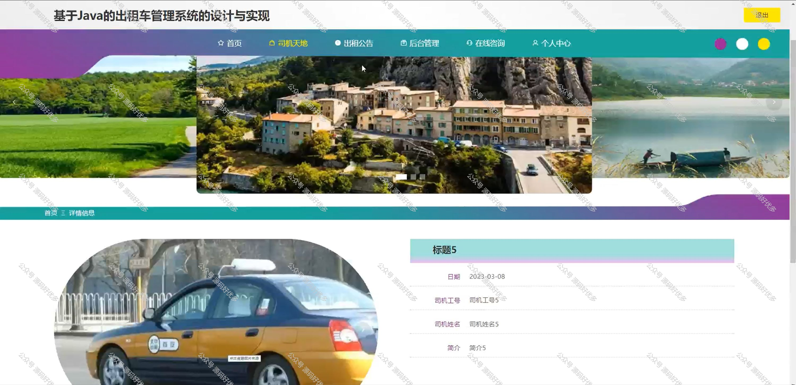
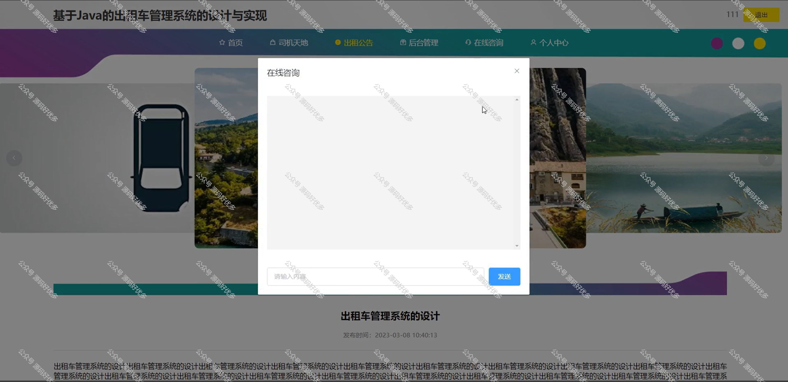
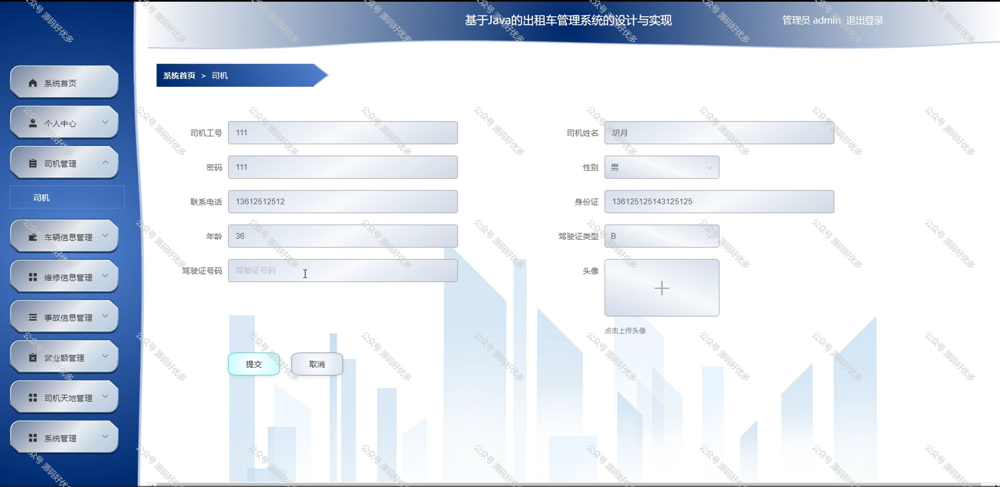
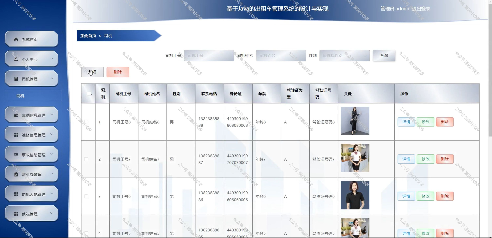
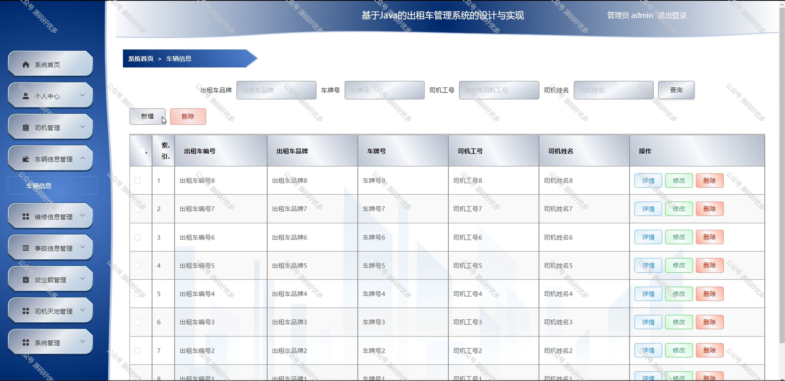

 
## 查看主页获取源码

### 一、作品包含

源码+数据库+全套环境和工具资源+部署教程

### 二、项目技术

前端技术：Html、Css、Js、Vue、Element-ui

数据库：MySQL

后端技术：Java、Spring Boot、MyBatis

  

### 三、运行环境

开发工具：IDEA/eclipse

数据库：MySQL5.7

数据库管理工具：Navicat10以上版本

环境配置软件： JDK1.8+Maven3.6.3

前端Nodejs：14

### 四、项目介绍
项目编号：springbootA249

在快速发展的城市交通网络中，出租车作为公共交通的重要组成部分，其服务质量和运营效率直接关系到市民的出行体验。为了更好地适应城市交通的复杂性，提高出租车行业的整体服务水平，出租车管理系统的引入显得尤为重要，它旨在通过现代化的管理手段，为出租车行业的健康发展提供支持，确保行业的有序运营。

前台用户功能：首页、司机天地、出租公告、后台管理、在线咨询、个人中心。

后台分为管理员和司机
管理员的功能：系统首页、个人中心、司机管理、车辆信息管理、维修信息管理、事故信息管理、营业额管理、司机天地管理、系统管理。
司机的功能：系统首页、个人中心、车辆信息管理、维修信息管理、事故信息管理和营业额管理。

### 五、运行截图

  
